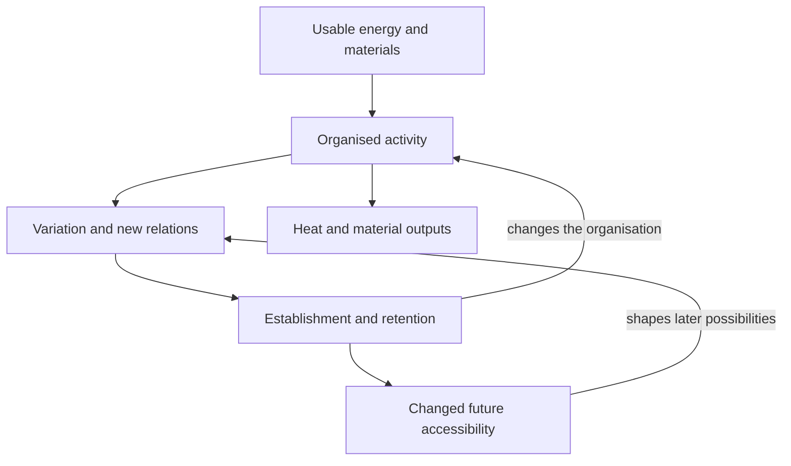

# Evolution by Emergence

**How does existing organisation make further organisation possible, and what allows that process to continue?**

Evolution by Emergence is an open research project by **Albert Jan van Hoek, with AI collaboration**, developing a general account of **how organisation evolves across living and nonliving systems**. Interacting processes can generate new capacities, retain some of them, and thereby change what can emerge next. The history of evolution can be carried by a web of relationships, exchanges, and combinations across scales.

The proposed mechanism is a **cumulative organisational ratchet**: under suitable resource and dynamical conditions, retained organisation becomes a starting point for further organisation. Usable energy drives the activity; the evolving network shapes how that energy is used and which subsequent changes become possible. Biological evolution, learning, and the development of technical and social systems are investigated within this wider framework.

The project brings together a book, mathematical papers, formal proofs, and applications to biological, artificial, and social systems. **SCAP, the Sustainable Collaborative Alignment Protocol, expresses the project's account of how learning systems can maintain the conditions of their own continuation.**

[Read the book][book] · [Explore the two core papers](#the-two-core-papers) · [Understand SCAP](#why-this-leads-to-scap) · [Listen on SoundCloud][soundcloud] · [Watch on YouTube][youtube]

## Why Evolution by Emergence

Darwinian natural selection explains differential propagation among heritable variants. Evolution by Emergence asks how the organisation already present helps determine **which variants, capacities, and persistent organisations can become available in the first place**. It also asks how those possibilities change when an innovation is retained. Where reproduction with heritable variation occurs, natural selection remains part of this account.

The emphasis is on an **evolving web**. A genealogical tree records branching descent; an interaction network records relationships that can cross those branches. Recombination, transfer, symbiosis, shared infrastructure, and incorporation across scales allow previously separate histories to combine. Networks can also produce new kinds of participants that subsequently alter the network that produced them.

Evolutionary biology already studies [reticulate histories][network-evolution] and [organisms changing their own selective environments][niche-construction]. The proposed extension brings these processes into an accessibility framework and investigates the same organisational question beyond biology. For each system, the mechanisms generating, retaining, and combining organisation must be identified.

The project's use of *evolution by emergence* means **historical change in which interactions generate organised capacities, retained capacities alter later possibilities, and the processes producing further change can themselves change**. Its scope includes chemical, biological, computational, technical, and social organisation. Establishing a particular ratchet requires evidence that retained change contributes to later accessibility.

## The ratchet under an energy gradient

Usable differences in physical conditions, such as chemical or electrical potentials, can drive organised activity. An open network uses available free energy and materials while producing heat and other outputs. Its organisation determines which pathways those flows follow, which capacities are maintained, and which new activities become affordable or constructible.

A system can persist while its participants change. Cells replace molecules, institutions replace members, and a workshop replaces machines. What continues is an organisation of activities and relations that makes further activity possible.

Imagine a workshop that builds a diagnostic tool. Earlier fault detection reduces breakdowns. Some of the saved time and materials support maintaining the tool and teaching others to use and repair it. Once this capacity is retained, the workshop may be able to operate equipment that was previously too fragile or costly. The first innovation has changed the conditions for the next one.

The papers distinguish two senses of ratchet. **Hysteretic retention** makes an established capacity maintainable under conditions in which it could not establish from rarity. A **cumulative organisational ratchet** additionally requires retained organisation to improve access to a specified later target. Repeating a maintenance cycle, or establishing hysteresis alone, does not establish that cumulative effect.

The proposed causal pattern is:



The **vortex analogy** captures recurrent organisation sustained by flow. The evolutionary addition is retained history: after a change, the network returns to maintaining itself with an altered repertoire, and perhaps altered ways of generating further change. A spiral suggests this recurrence with inherited change; a web captures the many paths that can split, combine, and support one another. These are images of the causal pattern. Literal rotation is not required, and an energy gradient alone does not establish a cumulative ratchet.

Three things therefore need explaining: how a new capacity arises, how its contribution returns to support its continuation, and how its retention changes later possibilities. A useful effect that never supports its own maintenance may disappear. A retained capacity can also create a trap or lose its usefulness when conditions change.

The central proposal is:

> **Existing organisation changes what organisation can follow. Previous viability can become infrastructure for subsequent viability.**

## The two core papers

These papers anchor two complementary parts of the project: **how further organisation becomes accessible**, and **which physical conditions bound the rate and depth of that process**. The [v9 release, published 13 September 2026][v9], includes the current fixed-resolution paper.

### Organizational Accessibility: From Self-Maintenance to Evolvability

This paper asks which persistent successor organisations can be reached from a given architecture, state, environment, and variation process over a specified time horizon.

It develops a resource-limited production model and distinguishes several ways in which history can matter:

- **Hysteretic retention:** an established organisation can persist under conditions in which it could not establish from rarity. The worked model separates establishment and maintenance thresholds analytically.
- **Inherited adaptive extension:** subsequent variation can begin from an already viable architecture, with a finite opportunity to generate and establish successors.
- **Compositional accessibility:** recombination, horizontal transfer, symbiosis, and incorporation across scales can reuse organisation developed elsewhere.
- **Evolvability:** the process that generates variation can itself change and be retained.

Its proposed test for cumulative emergence is causal: does retaining a structure acquired earlier increase access to a specified later target? This makes the contribution of organisational history something that can be investigated through interventions. The worked model establishes a retention mechanism; demonstrating a complete sequence of cumulative emergence remains a further test.

**Read:** [v7 paper PDF][oa-pdf] · [Machine-checked appendix PDF][oa-appendix] · [Paper repository, LaTeX, and Lean proofs][oa-repo]. The v7 reading copy and the verification appendix are available separately.

### Organizational Depth at Finite Time: A Fixed-Resolution No-Go Boundary

This paper asks what would make infinitely many organisational steps in finite time physically meaningful. An ever-increasing level number is insufficient: successive retained states must remain distinguishable at a specified resolution.

It closes a stochastic route to infinite depth under bounded material, a positive minimum material allocation per independently counted realisation, and bounded rates of candidate generation per realisation. Its general finite-action result bounds fixed-resolution depth under finite charged cost and time, uniform kinetic control, and a physical-to-operational distance comparison. For finite-state Markov jump dynamics, it derives an operational bound from finite entropy production and finite dynamical activity.

The result identifies what a proposed escape would have to change or overcome. It also explains why bounded throughput can coexist with increasingly rapid turnover of shrinking quantities without establishing infinite depth at fixed resolution.

**Read:** [Current paper PDF][depth-pdf] · [LaTeX source][depth-source] · [Lean proofs and verification scope][depth-lean].

Together, the papers connect the evolutionary proposal to explicit mechanisms, causal questions, and physical boundaries. The accessibility paper investigates how the repertoire of possible successors changes; the finite-time paper constrains claims about unlimited acceleration or depth. Their results concern specified systems and assumptions; increasing complexity is an outcome to explain in a particular case.

## Why this leads to SCAP

Within this evolutionary account, intelligence is one form of organisation that can retain information and use it to change subsequent activity. It depends on the processes and relationships that sustain it. Its internal model can be incomplete even when it appears entirely convincing from within. If two possible situations require different actions but its present model cannot distinguish them, successful action across those situations requires additional information and the capacity to change because of it.

That makes correction a functional dependency. Measurements, experiments, other observers, and communication can supply information unavailable within the current model. These channels require resources and maintenance. They can also prevent wasted effort, preserve accumulated knowledge, and make coordinated activity possible. When those contributions support the continuation of the channels that produced them, correction becomes part of a maintained organisation.

The argument now returns to organisational accessibility. Learning changes the starting conditions for later action. Teaching transmits capacities without requiring each participant to rediscover them. Repair can preserve an accumulated capability. Cooperation can sustain functions that participants cannot maintain separately. Each can change what the network can do next.

**SCAP applies this account to the organisation of learning itself.** It asks how a network can keep these functions operating across errors, changing conditions, and the arrival of new participants:

| Function | Role in continued learning and organisation |
|---|---|
| Reliable information and independent checking | Keep consequential errors detectable and prevent them from being repeatedly propagated. |
| Correction and repair | Restore functioning while retaining organisation that remains useful. |
| Maintenance of bodies, infrastructure, and resources | Sustain the physical conditions on which learning and action depend. |
| Transmission and renewal | Carry capacities across participant turnover and enable successors to improve them. |
| Revisable coordination and accountable control | Keep the network able to change arrangements that impair its functioning, including the protocol itself. |

The relevant necessity is causal: when continued functioning depends on a process, that function must remain available or be replaced. Which arrangement supplies it, at what cost, and under which conditions are questions for analysis and testing. A specific implementation of SCAP must answer those questions.

This is the meaning of **“keep alive what keeps you alive”** within the project. Maintaining a learning network can require replacing a component, revising a rule, or ending a relation that destroys its capacity to function. Continuity concerns the capacity to regenerate and adapt through change.

The argument is recursive: intelligence can learn about the conditions that produce and sustain intelligence, then act on those conditions. Organisation becomes capable of investigating and changing the processes through which further organisation becomes possible. SCAP makes the maintenance of that capacity explicit and subject to correction.

**Read:** [SCAP in the original book][scap] · [Temporal Reach and the Corrigibility Constraint][backbone] · [Existence First][existence-first].

## Where to start

| Your interest | Suggested route |
|---|---|
| Understand the whole project | Read this introduction, then the [book][book] and the [conceptual backbone][backbone]. |
| Examine the mathematics | Start with the two papers above and their linked formalisation projects. |
| Explore intelligence and cooperation | Read [Beyond the Singularity][singularity], the [Theory of Long-Term Collaboration][tlc], and [Autonomous Interdependence][interdependence]. |
| Investigate how to maintain learning systems | Start with [SCAP][scap] and [Existence First][existence-first]; identify a concrete dependency, failure, or intervention to test. |

The [reading website][website] provides another way to browse the material. The [essay collection][essays] contains further developments and applications. Earlier versions remain available to preserve the development of the work; identify the exact source and version when comparing claims.

## One project across three repositories

| Repository | What it contains |
|---|---|
| [Evolution by Emergence][ebe-repo] | The overall framework, book, SCAP, essays, reading website, and current fixed-resolution paper with its Lean project. |
| [Organizational Accessibility: From Self-Maintenance to Evolvability][oa-repo] | The dedicated paper source, figures, verification appendix, Lean development, and Python checks. |
| [Finite-Time Escape in Organizational Accessibility][escape-repo] | The earlier synthesis exploring spatial concentration, hierarchical cascades, stochastic explosion, and regularity. Read alongside the later fixed-resolution paper linked above. |

## Listen and watch

Music and video provide further ways into the project:

- **[Emergence 🐠 on SoundCloud][soundcloud]** — music and songs.
- **[Autonomous Interdependence on YouTube][youtube]** — the video channel.

## Examine and develop the work

This is an active research programme. The book develops the broader account; the papers define narrower mathematical objects and results; applications test whether the proposed mechanisms explain particular systems.

The Lean developments check specified mathematical implications. In the accessibility project, these include fold geometry and spectral results. In the depth project, they include rate bounds, finite-action bounds, and the operational measurement bridge. Their accompanying reports state the assumptions and the steps outside formal verification.

Useful contributions include a counterexample to a stated claim, a missing dependency or cost, an alternative explanation, a reproducible test, or an improvement to a proof. Specify the system, time horizon, source version, and observation that would distinguish the explanations. Use [issues][issues] or a pull request to contribute. [CLAIMS.md](CLAIMS.md) and [concepts.json](concepts.json) offer additional navigation and evaluation aids; check them against the relevant paper.

## Source, builds, and citation

The book's LaTeX entry point is [Instructions_to_complile_the_book.tex](Instructions_to_complile_the_book.tex), with its chapters in [Chapters/](Chapters/) and SCAP in [Backmatter/](Backmatter/). With a suitable LaTeX installation, build from the repository root:

```bash
latexmk -pdf Instructions_to_complile_the_book.tex
```

The [website workflow](.github/workflows/deploy.yml) documents figure generation, LaTeX conversion, and the MkDocs build. Follow the instructions in each paper's linked repository or verification directory to reproduce its results.

The project is available under [Creative Commons Attribution 4.0](License). When citing or reusing material, credit Albert Jan van Hoek and identify the work and the specific release or commit used. [citation.cff](citation.cff) contains the original book's citation metadata; [releases][releases] preserve versioned snapshots.

[book]: pdf%20of%20content/Evolution_by_Emergence_book.pdf
[website]: https://albertjanvanhoek.github.io/Evolution-by-Emergence/
[ebe-repo]: https://github.com/albertjanvanhoek/Evolution-by-Emergence
[oa-repo]: https://github.com/albertjanvanhoek/Organizational-Accessibility-From-Self-Maintenance-to-Evolvability
[oa-pdf]: pdf%20of%20content/organizational_accessibility_v7.pdf
[oa-appendix]: https://github.com/albertjanvanhoek/Organizational-Accessibility-From-Self-Maintenance-to-Evolvability/blob/main/formalization/appendix_standalone_preview.pdf
[depth-pdf]: https://github.com/albertjanvanhoek/Evolution-by-Emergence/releases/download/v9/Organizational_Depth_at_Finite_Time_proofread_final.pdf
[depth-source]: Individual_essays/Organizational%20Depth%20at%20Finite%20Time.tex
[depth-lean]: verification/organizational-depth/README.md
[escape-repo]: https://github.com/albertjanvanhoek/Finite-Time-Escape-in-Organizational-Accessibility
[scap]: Backmatter/Appendix.tex
[backbone]: pdf%20of%20content/temporal_reach_corrigibility_backbone.pdf
[existence-first]: Backmatter/Appendix26.tex
[singularity]: Individual_essays/Beyond%20the%20singularity.tex
[tlc]: Individual_essays/TLC.tex
[interdependence]: Individual_essays/Autonomous_Interdepence_essay.tex
[essays]: Individual_essays/
[soundcloud]: https://soundcloud.com/emergence-223803727
[youtube]: https://www.youtube.com/@AutonomousInterdependence
[issues]: https://github.com/albertjanvanhoek/Evolution-by-Emergence/issues
[releases]: https://github.com/albertjanvanhoek/Evolution-by-Emergence/releases
[v9]: https://github.com/albertjanvanhoek/Evolution-by-Emergence/releases/tag/v9
[network-evolution]: https://arxiv.org/abs/1405.2965
[niche-construction]: https://doi.org/10.1007/s10682-016-9821-z
