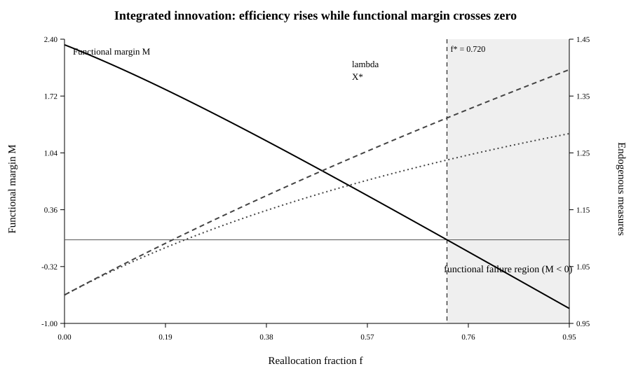
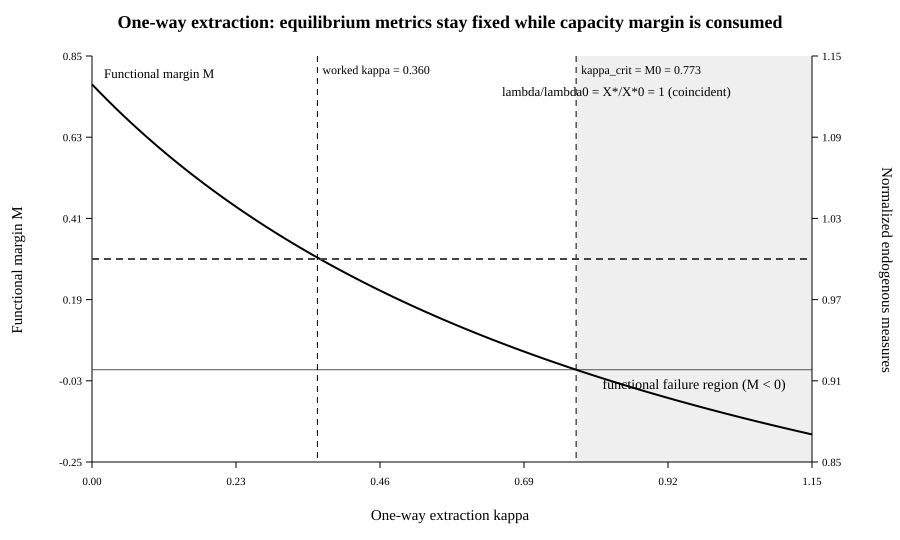

# Persistence Does Not Measure Function

## Separating fitness balance, productive efficiency, maintained mass, structural support, and functional capacity in self-maintaining networks

### Abstract

Self-maintaining systems are often compared using quantities that measure growth, replacement efficiency, equilibrium abundance, structural persistence, or function. These quantities need not measure the same property. We use a resource-limited production-network model to separate five coordinates: equilibrium fitness balance, productive efficiency, maintained mass, structural organization, and functional capacity.

At every positive equilibrium of the base model, mean gross production is pinned to the component loss rate and therefore cannot distinguish organizational states. Increasing the spectral radius of the production matrix lowers equilibrium resource requirement and strictly increases total maintained abundance. Yet greater spectral efficiency need not preserve composition or function. A more efficient independent self-producing component can competitively eliminate an interdependent network. Conversely, an irreducible production network retains every component at positive abundance, but individual components can nevertheless be quantitatively hollowed while productive efficiency and total maintained mass increase. A one-way downstream component provides a third case: spectral efficiency, equilibrium resource concentration, and total maintained mass can remain exactly unchanged while maintained material is redistributed away from the host organization.

These structural distinctions are governed by classical non-negative matrix and resource-competition theory. They do not determine what the system can do. We therefore introduce independently declared functional capacities \(\Phi_k(x)\) and thresholds \(\theta_k\). Two exact counterexamples follow. In an integrated innovation, productive efficiency and total maintained abundance increase monotonically while a required capacity crosses its failure threshold at \(f^*=0.7198206\). Under one-way extraction, all global equilibrium productivity measures remain unchanged while the functional margin is consumed. For any degree-one homogeneous capacity system under uniform dilution, the maximum tolerated extraction is exactly the host's pre-extraction functional margin,

\[
\kappa_{\rm crit}=M^0.
\]

The results show that persistence, efficiency, structural support, and functional capacity cannot be inferred from one another. Persistence alone does not order organizational states. Directional consequences arise only after a physical or functional asymmetry is specified; persistence determines how those consequences can be retained through time.

---

## 1. A counterexample problem

A self-maintaining organization continuously replaces what it loses. Cells replace molecular components, organisms replace cells, and technical or social organizations replace material and personnel. Persistence therefore need not mean persistence of the same material parts.

This observation invites a stronger inference: if one organization replaces itself more efficiently, maintains more material, or persists more robustly than another, perhaps it should also be regarded as more organized or more functionally capable.

The present paper tests that inference by counterexample.

Recent work has proposed directional descriptions of evolving systems. Functional-information theory defines function relative to specified performance and has been extended into a proposed law of increasing functional information under selection for function (Hazen et al., 2007; Wong et al., 2023). Assembly theory seeks quantitative signatures of historical selection and causal construction in complex objects (Sharma et al., 2023). The present analysis does **not** refute those frameworks wholesale. It addresses a narrower modelling question: whether persistence, productive efficiency, maintained abundance, or structural retention can themselves serve as proxies for independently specified function.

A counterexample has limited but sharp scope. One toy model cannot establish a universal alternative theory of organization. It can, however, refute a universal identification. If productive efficiency and functional capacity can move in opposite directions even in one internally consistent self-maintaining system, productive efficiency is not in general a measure of functional capacity.

The model below yields five distinct quantities:

\[
\boxed{
\text{fitness balance}
\neq
\text{productive efficiency}
\neq
\text{maintained mass}
\neq
\text{structural organization}
\neq
\text{functional capacity}.
}
\]

The aim is to identify exactly what each quantity measures and where the identification between them fails.

---

## 2. A resource-limited self-maintaining production network

Let \(x_i\ge0\) denote the abundance of executing component type \(i\), and let \(r\ge0\) denote activated substrate. A non-negative matrix \(B\) contains local replacement relations: \(B_{ij}\) is the rate at which component \(j\) produces component \(i\) per unit resource and producer abundance.

Components are lost at common rate \(d>0\). Activated substrate enters at rate \(J\ge0\), unused substrate is lost at rate \(\ell r\), and component production consumes substrate:

\[
\dot x=rBx-dx,
\qquad
\dot r=J-\ell r-r\mathbf 1^TBx.
\]

The model represents replacement bookkeeping rather than full thermodynamics.

Let \(\lambda=\rho(B)\) be the spectral radius. For irreducible \(B\), let \(p\gg0\) be its Perron eigenvector normalized by \(\mathbf 1^Tp=1\). A positive equilibrium satisfies

\[
Bp=\lambda p,\qquad
r^*=\frac d\lambda,
\]

and

\[
x^*=X^*p,\qquad
X^*=\frac{J-\ell d/\lambda}{d}
=\frac Jd-\frac\ell\lambda.
\]

Consequently,

\[
\frac{\partial r^*}{\partial\lambda}
=-\frac d{\lambda^2}<0,
\qquad
\boxed{
\frac{\partial X^*}{\partial\lambda}
=\frac\ell{\lambda^2}>0.
}
\]

Greater spectral efficiency therefore lowers equilibrium substrate requirement and strictly increases the total amount of maintained component material at fixed external supply. That result is exact. What it means organizationally is a separate question.

---

## 3. Equilibrium fitness balance is not an organizational coordinate

Define gross mean production at equilibrium by

\[
\bar w^*=r^*\,\mathbf 1^TBp.
\]

Since \(Bp=\lambda p\) and \(\mathbf 1^Tp=1\),

\[
\bar w^*=r^*\lambda=d.
\]

Thus

\[
\boxed{\bar w^*=d}
\]

for every positive Perron equilibrium.

Mean gross production is therefore a balance condition: production must equal loss. Architectures with different efficiencies, compositions, and topologies can have exactly the same equilibrium mean production.

Total abundance obeys

\[
\dot X=X(\bar w-d),
\]

so the equilibrium condition \(\bar w=d\) determines whether total mass is stationary, not what organization realizes that stationarity.

---

## 4. Productive efficiency is not organizational progress

Begin with a two-component unit cycle \(A\to B\to A\). Its production matrix has \(\lambda_{AB}=1\).

Now let \(A\) divert fraction \(f\) of its production capacity from \(B\) to a new component \(C\), while \(C\) contributes to production of \(A\) with coefficient \(v\):

\[
B(f,v)=
\begin{pmatrix}
0&1&v\\
1-f&0&0\\
f&0&0
\end{pmatrix},
\qquad
0<f<1,\quad v>0.
\]

The spectral radius is

\[
\lambda(f,v)=\sqrt{1-f+fv}
=\sqrt{1+f(v-1)}.
\]

Hence \(v>1\) implies \(\lambda(f,v)>1\). Within this architectural family, the new component provides enough productive return to offset the opportunity cost of diverting production away from \(B\).

This does not imply a general increase in organization.

Suppose instead that an independent self-producing component \(D\) enters with spectral efficiency \(\lambda_D\) exceeding that of the host network, \(\lambda_H\). Its break-even resource concentration is

\[
R_D^*=\frac d{\lambda_D}.
\]

Here \(R^*\) is used in the classical resource-competition sense: the equilibrium concentration of the limiting resource required by a persisting competitor.

If \(\lambda_D>\lambda_H\), then \(R_D^*<R_H^*\). At \(D\)'s equilibrium resource level, the leading host growth rate is

\[
R_D^*\lambda_H-d
=
d\left(\frac{\lambda_H}{\lambda_D}-1\right)<0.
\]

The higher-\(\lambda\) independent producer can therefore exclude the previous interdependent network. This is classical single-resource competition rather than a new exclusion theorem (Tilman, 1980, 1982). The organizational point is that the same scalar \(\lambda\) describes both an efficiency improvement inside an integrated network and displacement of that network by another reproducing class.

---

## 5. Positive support is not quantitative preservation

For the integrated \(A\)-\(B\)-\(C\) architecture with \(0<f<1\) and \(v>0\), the production graph is strongly connected and \(B(f,v)\) is irreducible.

An eigenvector corresponding to \(\lambda\) is

\[
(\lambda,1-f,f)^T.
\]

After normalization,

\[
p_A=\frac\lambda{1+\lambda},
\qquad
p_B=\frac{1-f}{1+\lambda},
\qquad
p_C=\frac f{1+\lambda}.
\]

Perron-Frobenius theory guarantees \(p_A,p_B,p_C>0\). But

\[
p_B=
\frac{1-f}{1+\lambda(f,v)}
\longrightarrow0
\qquad\text{as }f\to1^-.
\]

Thus irreducibility protects support but not quantitative preservation. A type can remain mathematically present while becoming arbitrarily rare. If an externally required function depends on a minimum contribution from that type, positive support does not imply preservation of the function.

---

## 6. Reducible networks and communicating structure

Irreducibility is sufficient for full Perron support but not necessary. For example,

\[
B=
\begin{pmatrix}
2&0\\
1&1
\end{pmatrix}
\]

is reducible, yet

\[
B
\begin{pmatrix}
1\\1
\end{pmatrix}
=
2
\begin{pmatrix}
1\\1
\end{pmatrix}.
\]

Both types can therefore occur at positive abundance in a dominant eigenvector.

For a general reducible non-negative matrix, equilibrium support is governed by strongly connected components, their accessibility relations, and their block spectral radii. In degenerate cases the dominant eigenspace can be multidimensional, so there need not be a unique Perron vector; the appropriate object is the non-negative Perron cone and its possible supports. These are standard results in reducible Perron-Frobenius theory (Berman and Plemmons, 1994; Rothblum, 1975).

Three non-degenerate topologies are useful here:

1. **Integrated extension:** old and new types lie inside one strongly connected production class.
2. **One-way downstream extension:** the host produces another type that provides no productive return.
3. **Resource-competing extension:** a separate self-maintaining class competes for the same limiting substrate.

Exact equal-spectral-radius ties form an additional boundary case. They can produce non-unique dominant eigenspaces and neutral coexistence structures and therefore matter for theorem statements, although they are non-generic under continuous perturbations of coefficients.

The graph classification describes production structure. It does not yet define function.

---

## 7. One-way downstream extraction

Let \(H\) be an irreducible host production matrix with Perron pair

\[
Hu=\lambda u,\qquad
\mathbf 1^Tu=1.
\]

Add a downstream component \(P\):

\[
B'=
\begin{pmatrix}
H&0\\
q^T&0
\end{pmatrix}.
\]

The new component is produced by the host but returns no production to it. An eigenvector of \(B'\) with eigenvalue \(\lambda\) has the form \((u,y)^T\), where \(q^Tu=\lambda y\). Define

\[
\kappa=\frac{q^Tu}{\lambda}.
\]

After normalization,

\[
p'_{\rm host}
=\frac u{1+\kappa},
\qquad
p'_P
=\frac\kappa{1+\kappa}.
\]

Every host type is diluted by exactly the same factor,

\[
\boxed{\frac1{1+\kappa}}.
\]

For any two host types \(i,j\),

\[
\frac{p'_i}{p'_j}
=
\frac{p_i}{p_j}.
\]

The host's internal relative composition is exactly preserved. The spectral radius is also unchanged, so

\[
r^{*\prime}=r^*,
\qquad
X^{*\prime}=X^*.
\]

Total maintained mass has not disappeared. It has been redistributed:

\[
X'_{\rm host}
=\frac{X^*}{1+\kappa},
\qquad
X'_P
=\frac{\kappa X^*}{1+\kappa}.
\]

Thus productive efficiency, equilibrium resource level, and total maintained mass can all remain unchanged while an increasing fraction of maintained material is transferred downstream. Support and full-system entropy can detect that a new component has appeared; they do not determine whether its share is harmless, useful, or sufficient to compromise a required host function.

---

## 8. Functional capacity is an independently declared measurement layer

To ask whether the organization still performs an externally relevant task, define capacities

\[
\Phi(x)=(\Phi_1(x),\ldots,\Phi_m(x))
\]

and positive thresholds

\[
\theta=(\theta_1,\ldots,\theta_m).
\]

Functional viability requires

\[
\Phi_k(x)\ge\theta_k
\qquad\forall k.
\]

The fact that the capacity definition is external is crucial. A complicated map is not automatically more functional than a simple one. Even

\[
\Phi_B(x)=x_B
\]

can be a legitimate capacity observable if component \(B\) supplies one unit of a prespecified service per unit abundance. What makes the criterion independent is that the service interpretation and threshold are declared **before** architectures are compared.

For additive services,

\[
\Phi^{\rm lin}(x)=Gx.
\]

For complementary functions, a Leontief form may be appropriate:

\[
\Phi_k(x)
=
\min_{j\in R_k}
\frac{x_j}{a_{kj}}.
\]

Define the normalized limiting functional margin

\[
\boxed{
M(x)
=
\min_k
\left[
\frac{\Phi_k(x)}{\theta_k}-1
\right].
}
\]

Then \(M\ge0\) means all declared capacities meet threshold, while \(M<0\) means at least one required capacity has failed.

---

## 9. Prespecified worked capacity system

The functional experiment is fixed before evaluating the hollowing and extraction trajectories:

\[
J=2,\qquad d=\ell=1,\qquad v=2,\qquad f_0=0.5.
\]

At the reference host state,

\[
\lambda_0=\sqrt{1.5}=1.2247449,
\qquad
X_0^*=2-\frac1{\lambda_0}=1.1835034,
\]

and

\[
x_A^0=0.6515308,
\qquad
x_B^0=x_C^0=0.2659863.
\]

Two additive capacities are declared:

\[
\begin{pmatrix}
\Phi_1\\
\Phi_2
\end{pmatrix}
=
Gx,
\qquad
G=
\begin{pmatrix}
0&1&0\\
1&0&1
\end{pmatrix}.
\]

Thus \(\Phi_1=x_B\) is a \(B\)-specific service, while \(\Phi_2=x_A+x_C\) is a service supplied additively by \(A\) and \(C\). Their thresholds are

\[
\theta_1=0.15,
\qquad
\theta_2=0.50.
\]

A complementary capacity is also evaluated:

\[
\Phi_3(x)=\min(x_A,x_B),
\qquad
\theta_3=0.15.
\]

This represents a task requiring both \(A\) and \(B\) in matched units.

At the reference state,

\[
\Phi_1^0=0.2659863,
\qquad
\Phi_2^0=0.9175171,
\qquad
\Phi_3^0=0.2659863.
\]

The corresponding margins are approximately \(0.773242\), \(0.835034\), and \(0.773242\), so

\[
\boxed{M^0=0.773242.}
\]

The same prespecified capacity system is used in both examples below.

---

## 10. Integrated hollowing crosses a functional threshold while efficiency improves

For \(v=2\),

\[
\lambda(f)=\sqrt{1+f},
\qquad
X^*(f)=2-\frac1{\lambda(f)}.
\]

The abundance of \(B\) is

\[
x_B^*(f)
=
X^*(f)
\frac{1-f}{1+\lambda(f)}.
\]

The \(B\)-specific capacity is therefore \(\Phi_1(f)=x_B^*(f)\). For \(f\ge0.5\), \(x_B\le x_A\), so the complementary capacity \(\Phi_3=\min(x_A,x_B)\) has the same limiting value. The additive \(A+C\) capacity remains above threshold over the crossing considered here.

Functional failure occurs when

\[
x_B^*=0.15.
\]

Writing the equality in terms of \(\lambda\) gives

\[
40\lambda^3-17\lambda^2-77\lambda+40=0.
\]

Its physically relevant root is \(\lambda^*=1.3114193\), giving

\[
\boxed{f^*=0.7198206}
\]

and \(X^*=1.2375\) to four decimal places.

As \(f\) increases through the functional boundary,

\[
\lambda\uparrow,
\qquad
X^*\uparrow,
\qquad
M\downarrow\text{ through }0.
\]

Every type remains strictly positive and the matrix remains irreducible throughout the physical interval \(0<f<1\). Functional failure therefore occurs without loss of support and while endogenous efficiency and total mass are improving.

**Figure 1. Integrated hollowing.** Functional margin \(M\) as a function of reallocation fraction \(f\), with \(f>f^*\) shaded as the failure region. The secondary axis shows \(\lambda\) and \(X^*\), both rising monotonically through the functional boundary. The scientifically relevant crossing is \(M=0\) on the primary axis; its location is independent of secondary-axis scaling.

The effect is not dependent on tuning \(\theta_B=0.15\). Since \(x_B^*(f)\) decreases continuously from \(x_B^*(0)=0.5\) to zero, every threshold \(0<\theta_B<0.5\) has a unique crossing.

| \(\theta_B\) | 0.05 | 0.10 | 0.15 | 0.20 | 0.25 | 0.30 |
|---|---:|---:|---:|---:|---:|---:|
| \(f^*\) | 0.907 | 0.813 | **0.720** | 0.626 | 0.531 | 0.434 |

Thus

\[
\boxed{
\text{productive efficiency can improve continuously while a declared function fails.}
}
\]

---

## 11. Uniform extraction: the functional margin is the extraction budget

The extraction result generalizes beyond linear capacities. Suppose each required host capacity is homogeneous of degree one:

\[
\Phi_k(cx)
=
c\,\Phi_k(x),
\qquad
c\ge0.
\]

This includes ordinary linear capacities \(Gx\). It also includes Leontief complementarity because

\[
\min_j\frac{cx_j}{a_{kj}}
=
c
\min_j\frac{x_j}{a_{kj}}.
\]

Define

\[
S(x)=\min_k\frac{\Phi_k(x)}{\theta_k}.
\]

Then \(S(cx)=cS(x)\). Since \(M(x)=S(x)-1\), uniform host dilution by

\[
c=\frac1{1+\kappa}
\]

gives

\[
M(\kappa)
=
\frac{1+M^0}{1+\kappa}-1
=
\boxed{
\frac{M^0-\kappa}{1+\kappa}
}.
\]

For \(\kappa\ge0\),

\[
M(\kappa)\ge0
\iff
\kappa\le M^0.
\]

Therefore

\[
\boxed{\kappa_{\rm crit}=M^0.}
\]

A host organization can absorb uniform one-way extraction up to exactly its own pre-extraction functional margin.

For the prespecified reference system, \(M^0=0.773242\). At \(\kappa=0.360\),

\[
\frac{0.360}{0.773242}=0.466,
\]

so 46.6% of the extraction tolerance has been consumed.

Throughout this extraction trajectory,

\[
\lambda=\lambda_0,
\qquad
r^*=r_0^*,
\qquad
X^*=X_0^*.
\]

The host-internal abundance ratios are also exactly invariant.

**Figure 2. One-way extraction.** Functional margin \(M(\kappa)\) under uniform downstream dilution. The failure region \(\kappa>M^0\) is shaded. The normalized spectral radius and total maintained abundance coincide exactly at one because neither changes with \(\kappa\). The crossing that matters is \(M=0\) on the primary axis; secondary-axis scaling cannot move that threshold.

---

## 12. Two mechanisms of diagnostic failure

The two examples fail for different reasons.

**Hollowing**

\[
\lambda\uparrow,\qquad
X^*\uparrow,\qquad
M\downarrow\text{ through }0.
\]

Endogenous productivity measures improve while a function fails.

**Extraction**

\[
\lambda=\text{constant},
\qquad
r^*=\text{constant},
\qquad
X^*=\text{constant},
\]

while \(M\downarrow\) through zero.

These examples support the narrower claim

\[
\boxed{
\text{none of the endogenous structural or productive observables considered here recovers the prespecified functional verdict.}
}
\]

This is not a claim that those observables are uninformative. They answer different questions.

| Quantity | Question answered |
|---|---|
| \(\bar w^*=d\) | Is gross replacement balancing component loss? |
| \(\lambda=\rho(B)\) | How effective is collective component production? |
| \(X^*\) | How much component material can be maintained? |
| Perron support / SCC structure | Which types and production classes can occur at equilibrium? |
| \(\Phi,\theta,M\) | Are independently specified functions above required thresholds? |

---

## 13. Relation to classical theory and Organizational Accessibility

The mathematical ingredients of the structural analysis are mostly classical.

Strict positivity for irreducible non-negative matrices is Perron-Frobenius theory. The support structure of reducible matrices belongs to the classical theory of communicating classes and non-negative eigenspaces (Berman and Plemmons, 1994; Rothblum, 1975). Competitive exclusion by the lower break-even resource requirement is an instance of resource-competition theory (Tilman, 1980, 1982).

The contribution here is therefore not a new spectral theorem. It is the identification of which organizational questions those results answer inside a self-maintaining production model—and which questions they do not.

This paper also acts as a diagnostic companion to the working framework *Organizational Accessibility: From Self-Maintenance to Evolvability—A Dynamical Framework for Cumulative Emergence* (van Hoek, 2026). That framework asks how retained organization changes which future organizations are accessible. The present analysis adds a constraint on interpretation: retention, increased accessibility, or improved replacement efficiency cannot by themselves be called functional improvement unless the relevant function has been separately defined.

\[
\boxed{
\text{persistence}
\neq
\text{structural preservation}
\neq
\text{functional preservation}.
}
\]

---

## 14. Where direction enters

The counterexamples do not support a universal arrow from persistence toward more organization.

Every genuine directional result has a locatable source. In the integrated innovation, \(v>1\) means that \(C\)'s productive return exceeds the opportunity cost imposed by diverting production away from \(B\). In resource competition, \(\lambda_1>\lambda_2\) creates an ordering of break-even resource concentrations. In the functional analysis, \(\theta_k\) specifies what level of performance counts as adequate. In one-way extraction, \(\kappa>0\) specifies a directional redistribution of maintained material.

These asymmetries are not illegitimate assumptions. Physical systems contain asymmetries. The methodological requirement is to identify them rather than attributing their directional consequences to persistence itself.

Thus

\[
\boxed{
\text{There is no direction without a physical or functional asymmetry.}
\]

Once the asymmetry is independently specified, its consequences can be derived rather than assumed.

Persistence plays another role:

\[
\boxed{
\text{Persistence can make the consequences of those asymmetries historically persistent.}
\]

---

## 15. Machine verification

The elementary threshold results were formalized in Lean 4. The authoritative paper-specific source is:

    formalization/persistence-drift/FunctionalThresholds.lean

The machine-checked statements include

\[
M(\kappa)=\frac{M^0-\kappa}{1+\kappa},
\]

\[
M(\kappa)\ge0
\iff
\kappa\le M^0
\qquad(\kappa\ge0),
\]

and therefore \(\kappa_{\rm crit}=M^0\).

The formalization also proves that the extraction-margin transformation applies to a capacity score homogeneous of degree one under uniform host scaling.

For the integrated example, Lean verifies the equivalence between \(x_B^*=0.15\) and

\[
40\lambda^3-17\lambda^2-77\lambda+40=0,
\]

together with \(f=\lambda^2-1\) for \(v=2\).

The monotonicity theorem is restricted to the physical branch

\[
1\le\lambda<\sqrt2,
\]

encoded algebraically by \(\lambda^2<2\), corresponding to \(0\le f<1\).

The paper-specific proof state was verified at commit:

    eadc51028da96fd7e92fe38af66b61743bae10a0

See [REPRODUCIBILITY.md](REPRODUCIBILITY.md) for theorem names, build commands, and figure-generation instructions.

Machine verification establishes algebraic implications of the model assumptions. It does not validate the interpretation or empirical appropriateness of declared capacities and thresholds.

---

## 16. Discussion

The simplest result is negative but useful: persistence does not provide a universal organizational ordering.

Mean fitness fails as an organizational measure because positive equilibrium pins it to the loss rate. Spectral radius is a valid measure of replacement efficiency, but it cannot tell whether productive return is distributed through an integrated network or concentrated in an independent competitor. Total abundance measures maintained material but not what that material is doing. Irreducibility and Perron support determine whether types remain represented but cannot establish quantitative sufficiency. Communicating-class topology distinguishes integrated, downstream, and competing production relations but does not determine whether a downstream component is exploitative or indispensable at a broader organizational boundary.

Functional capacity answers that last question only after a measurement boundary is declared.

This is why the simplicity of the worked capacity \(\Phi_1=x_B\) is not a defect. It isolates the logic. The functional content lies in the prior statement that \(B\) supplies a relevant service and that the service fails below \(\theta_1=0.15\). The second additive capacity and complementary Leontief capacity show that the framework is not restricted to identity mappings, while the homogeneous-capacity theorem establishes that the extraction result is not specific to linear \(Gx\).

The threshold sensitivity analysis clarifies what is and is not universal. The precise value \(f^*=0.7198206\) depends on the chosen functional requirement. The existence of an interior crossing does not: for every positive threshold below the baseline \(B\) capacity, increasing reallocation eventually crosses it while \(\lambda\) and \(X^*\) continue to rise.

A counterexample paper should stop there. This model does not show that functional capacity generally declines with efficiency, nor that organizational evolution lacks long-run trends. It shows that such trends cannot be inferred from persistence, spectral efficiency, maintained abundance, or positive structural support alone.

---

## 17. Conclusion

Self-maintenance, productive efficiency, maintained mass, structural support, and functional capacity are different properties.

The resource-limited production network makes their separation explicit. At positive equilibrium, \(\bar w^*=d\) regardless of architecture. Increasing \(\lambda\) lowers required resource concentration and increases total maintained abundance. Yet an integrated organization can become functionally hollow while remaining irreducible and increasingly efficient. A downstream process can consume functional margin while leaving \(\lambda\), \(r^*\), and \(X^*\) unchanged. A higher-\(\lambda\) independent competitor can replace a lower-\(\lambda\) interdependent network altogether.

The functional criterion must therefore be stated independently:

\[
\Phi_k(x)\ge\theta_k.
\]

For degree-one homogeneous capacities under uniform extraction,

\[
\boxed{\kappa_{\rm crit}=M^0.}
\]

The broader conclusion is not a law of increasing organization. It is a measurement principle:

\[
\boxed{\text{Persistence does not measure function.}}
\]

And a methodological principle:

\[
\boxed{\text{There is no direction without a physical or functional asymmetry.}}
\]

Once such an asymmetry is independently specified, its consequences can be derived.

Persistence does something different: it can make those consequences endure.

---

## References

Berman, A., & Plemmons, R. J. (1994). *Nonnegative Matrices in the Mathematical Sciences*. SIAM.

Hazen, R. M., Griffin, P. L., Carothers, J. M., & Szostak, J. W. (2007). Functional information and the emergence of biocomplexity. *Proceedings of the National Academy of Sciences*, 104(Suppl. 1), 8574–8581. https://doi.org/10.1073/pnas.0701744104

Rothblum, U. G. (1975). Algebraic eigenspaces of nonnegative matrices. *Linear Algebra and its Applications*, 12(3), 281–292. https://doi.org/10.1016/0024-3795(75)90050-6

Sharma, A., Czégel, D., Lachmann, M., Kempes, C. P., Walker, S. I., & Cronin, L. (2023). Assembly theory explains and quantifies selection and evolution. *Nature*, 622, 321–328. https://doi.org/10.1038/s41586-023-06600-9

Tilman, D. (1980). Resources: A graphical-mechanistic approach to competition and predation. *The American Naturalist*, 116(3), 362–393. https://doi.org/10.1086/283633

Tilman, D. (1982). *Resource Competition and Community Structure*. Princeton University Press.

van Hoek, A. J. (2026). *Organizational Accessibility: From Self-Maintenance to Evolvability—A Dynamical Framework for Cumulative Emergence*. Working manuscript in this repository.

Wong, M. L., Cleland, C. E., Arend, D. Jr., Bartlett, S., Cleaves, H. J. II, Demarest, H., Prabhu, A., Lunine, J. I., & Hazen, R. M. (2023). On the roles of function and selection in evolving systems. *Proceedings of the National Academy of Sciences*, 120(43), e2310223120. https://doi.org/10.1073/pnas.2310223120
