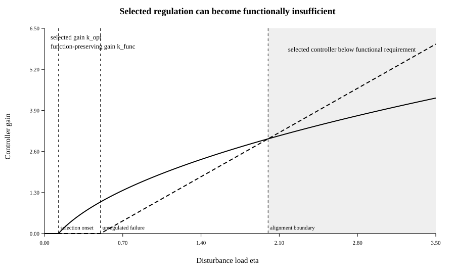
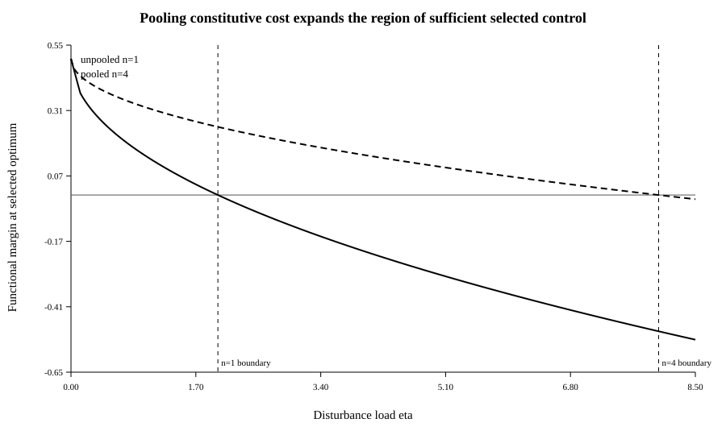

# When Does Regulation Pay?

## Functional control, regulatory retention, and the cost of staying within bounds

### Abstract

Self-maintaining systems do not merely replace what they lose. They also sense deviations, activate corrective responses, and suppress processes that threaten continued function. The preceding companion paper showed that persistence, productive efficiency, maintained mass, structural support, and functional capacity cannot be inferred from one another when regulation is absent. Here we ask the next question: when does a self-maintaining system retain the machinery that keeps its own functional variables within bounds?

We introduce a minimal negative-feedback model in which a deviation variable \(z\) receives disturbance input \(\eta\), relaxes passively at rate \(\gamma\), and is actively reduced by control \(u=kz\) with efficacy \(\beta\). A declared functional tolerance \(m\) gives margin \(M=m-z\). Regulation carries two costs: a constitutive cost \(c_0k\) for installed control capacity and an activity-dependent cost \(c_1u\). Deviation itself carries growth or maintenance penalty \(Lz\).

The model separates two thresholds. Functional sufficiency requires enough gain to keep \(M\ge0\). Evolutionary or maintenance retention, under the stated scalar growth objective, requires the return from reduced deviation to exceed controller cost. Defining \(A=\beta L-c_1\gamma\), the growth-optimal positive controller is

\[
k_{\rm opt}
=
\frac{\sqrt{\eta A/c_0}-\gamma}{\beta},
\]

whereas the minimum function-preserving gain is

\[
k_{\rm func}
=
\max\left\{0,\frac{\eta/m-\gamma}{\beta}\right\}.
\]

At the selected optimum,

\[
M_{\rm opt}
=
m-\sqrt{\frac{\eta c_0}{A}}.
\]

Thus selection can retain regulation while selecting too little regulation to satisfy the independently declared functional requirement. The selected optimum is functionally sufficient exactly when

\[
\eta\le\frac{A m^2}{c_0}.
\]

If constitutive regulatory cost is shared across \(n\) beneficiaries, this boundary expands linearly to \(\eta\le nAm^2/c_0\).

The result complements established work on economy–effectiveness tradeoffs, sensory adaptation, and responsive gene expression. Its contribution is not a new theory of feedback control, but an explicit bridge between endogenous regulation and an independently specified functional margin. Negative feedback and positive maintenance return are distinct properties. Regulation can be dynamically effective yet selectively disfavored, selectively favored yet functionally insufficient, or both retained and sufficient. This distinction provides a quantitative route from self-maintenance to the evolution of the mechanisms that regulate self-maintenance.

---

## 1. From self-maintenance to regulation

A self-maintaining system must replace what it loses. A living system must do more.

Cells continuously control metabolite concentrations, protein quality, DNA integrity, osmotic balance, membrane potential, replication, division, stress responses, and many other variables. Multicellular organisms add endocrine, immune, neural, developmental, and behavioural regulation. These systems do not merely produce components. They respond differently depending on the state they sense.

That difference is absent from a constant production matrix.

The companion paper, *Persistence Does Not Measure Function*, deliberately studied a model with fixed production coefficients. It showed that increasing productive efficiency can accompany functional failure, that irreducible support can conceal quantitative hollowing, and that one-way extraction can consume functional margin while global equilibrium measures remain unchanged. Those counterexamples required the functional capacity map and its thresholds to be evaluated from outside the dynamics.

The obvious next question is whether regulation closes that gap.

In biological terms, regulation has been described as control exerted from within an organization over its own constitutive production and maintenance dynamics (Bich et al., 2016). Control-theoretic work emphasizes negative feedback, robustness, sensitivity minimization, and the unavoidable tradeoffs associated with disturbance rejection (Biswas and Iglesias, 2021). Biophysical work shows that accurate adaptive sensing requires ongoing energetic dissipation and exhibits energy–speed–accuracy tradeoffs (Lan et al., 2012). Evolutionary systems biology has directly studied economy–effectiveness tradeoffs in homeostatic regulation (Szekely et al., 2013), while microbial studies show that protein expression and regulation evolve under measurable cost–benefit constraints (Dekel and Alon, 2005; Poelwijk et al., 2011).

The question here is therefore not whether regulation has costs. That is established.

The narrower question is:

> **When the organism itself regulates a functional variable, does the controller strength favored by the selected growth objective necessarily suffice to satisfy the functional requirement?**

The answer in the minimal model below is no.

That distinction matters because it separates two optimization problems that are often treated as if they were identical:

1. **control sufficiency:** enough feedback to keep a variable inside a declared functional region;
2. **regulatory retention:** enough return from control to justify its constitutive and activity-dependent costs.

The paper's main result is the exact boundary between them.

---

## 2. Negative feedback is not negative return

The word "negative" appears in two different senses that should not be conflated.

A negative-feedback controller acts against a deviation. If a regulated variable moves away from its target, controller activity increases in a direction that reduces that deviation.

This says nothing about whether the controller is beneficial to persistence.

A regulator can implement negative feedback while producing a positive net maintenance return. Conversely, a regulator can be dynamically effective but too expensive to retain.

This is the same separation encountered earlier between topology and return. In the present model:

- feedback sign concerns the sign of the controller's action on the regulated variable;
- net return concerns the effect of that controller on the selected growth or maintenance objective after its costs are charged.

The central phrase of this paper is therefore:

\[
\boxed{
\text{negative feedback, positive return}.
}
\]

The first is a control property. The second is an economic or evolutionary property.

---

## 3. Minimal endogenous-control model

Let

\[
z(t)\ge0
\]

denote a deviation, damage load, deficit, or other state whose increase is undesirable. We do not assume that all biological regulation can be reduced to one scalar. The scalar model is chosen to expose the minimum bookkeeping required for the distinction.

Deviation enters at rate

\[
\eta>0.
\]

In the absence of regulation it relaxes passively at rate

\[
\gamma z,
\qquad
\gamma>0.
\]

A controller senses the deviation and responds proportionally:

\[
u=kz,
\qquad
k\ge0.
\]

Regulatory activity removes deviation with efficacy

\[
\beta>0.
\]

The controlled dynamics are therefore

\[
\boxed{
\dot z
=
\eta-\gamma z-\beta u,
\qquad
u=kz.
}
\]

Substitution gives

\[
\dot z
=
\eta-(\gamma+\beta k)z.
\]

This is negative feedback: larger \(z\) produces larger \(u\), and \(u\) enters the deviation equation with negative sign.

The unique steady state is

\[
\boxed{
z^*(k)
=
\frac{\eta}{\gamma+\beta k}.
}
\]

Increasing controller gain reduces the steady deviation monotonically.

---

## 4. Functional margin and the control threshold

Let

\[
m>0
\]

be the maximum tolerated steady deviation for a specified function.

Define the functional margin

\[
\boxed{
M^*(k)
=
m-z^*(k).
}
\]

The functional requirement is

\[
M^*(k)\ge0.
\]

Using the equilibrium expression gives

\[
m-\frac{\eta}{\gamma+\beta k}
\ge0.
\]

Because the denominator is positive,

\[
\boxed{
M^*(k)\ge0
\iff
\eta\le m(\gamma+\beta k).
}
\]

This is the first threshold.

Without regulation, the system satisfies the functional requirement only when

\[
\eta\le m\gamma.
\]

If disturbance exceeds that level,

\[
\eta>m\gamma,
\]

the minimum function-preserving gain is

\[
\boxed{
k_{\rm func}
=
\frac{\eta/m-\gamma}{\beta}.
}
\]

Combining the two cases,

\[
\boxed{
k_{\rm func}
=
\max\left\{
0,
\frac{\eta/m-\gamma}{\beta}
\right\}.
}
\]

This threshold contains no evolutionary claim. It simply asks how much control is required to hold the declared variable inside the declared region.

---

## 5. The regulator must itself be paid for

Regulation is not free.

We distinguish two controller costs.

First, maintaining regulatory capacity has a constitutive cost. Sensors, regulatory proteins, signaling infrastructure, checkpoints, repair machinery, memory, and preparedness can impose costs even when little corrective action is currently required. We represent this by

\[
c_0 k,
\qquad
c_0>0.
\]

Second, using the controller has an activity-dependent cost. Since

\[
u=kz,
\]

we write this as

\[
c_1u
=
c_1kz,
\qquad
c_1\ge0.
\]

Finally, deviation itself carries a penalty to the selected growth or maintenance objective:

\[
Lz,
\qquad
L>0.
\]

Let \(g_0\) denote the growth or maintenance return of the productive core before these losses are charged. At equilibrium,

\[
\boxed{
g(k)
=
g_0
-
Lz^*(k)
-
c_0k
-
c_1kz^*(k).
}
\]

This is a deliberately explicit objective. It is not asserted to be the universal currency of natural selection. It is the selected scalar in the present model.

Relative to the unregulated state,

\[
\Delta g(k)
=
g(k)-g(0).
\]

Hence

\[
\Delta g(k)
=
L[z^*(0)-z^*(k)]
-c_0k-c_1kz^*(k).
\]

Substituting

\[
z^*(0)=\frac{\eta}{\gamma},
\qquad
z^*(k)=\frac{\eta}{\gamma+\beta k},
\]

and defining

\[
\boxed{
A
=
\beta L-c_1\gamma,
}
\]

gives

\[
\boxed{
\Delta g(k)
=
\frac{
k[
\eta A
-
c_0\gamma(\gamma+\beta k)
]
}{
\gamma(\gamma+\beta k)
}.
}
\]

The expression \(A\) is the first return condition.

If

\[
A\le0,
\]

then increasing activity cannot generate enough avoided damage to offset its activity-dependent cost, even before constitutive cost is considered. No positive controller gain has positive return under the stated objective.

This is the regulatory analogue of the earlier distinction between feedback sign and productive return.

Negative feedback can exist with

\[
A\le0.
\]

It works dynamically, but it does not pay.

---

## 6. When regulation is retained

Assume

\[
A>0.
\]

Differentiating the regulatory advantage gives

\[
\boxed{
\frac{d\Delta g}{dk}
=
\frac{\eta A}{(\gamma+\beta k)^2}
-
c_0.
}
\]

The second derivative is

\[
\boxed{
\frac{d^2\Delta g}{dk^2}
=
-\frac{2\eta A\beta}{(\gamma+\beta k)^3}
<0.
}
\]

Thus the objective is strictly concave in \(k\).

Regulation is selected away from zero only if the marginal return at zero is positive:

\[
\frac{\eta A}{\gamma^2}
>
c_0.
\]

Equivalently,

\[
\boxed{
\eta A
>
c_0\gamma^2.
}
\]

This yields a disturbance threshold for retention:

\[
\boxed{
\eta_{\rm sel}
=
\frac{c_0\gamma^2}{A}.
}
\]

Below this value, the selected optimum is

\[
k_{\rm opt}=0.
\]

Above it, the unique positive optimum is obtained from

\[
\frac{\eta A}{(\gamma+\beta k)^2}
=
c_0.
\]

Therefore

\[
\gamma+\beta k_{\rm opt}
=
\sqrt{\frac{\eta A}{c_0}},
\]

and

\[
\boxed{
k_{\rm opt}
=
\frac{
\sqrt{\eta A/c_0}
-
\gamma
}{
\beta
}.
}
\]

Disturbance therefore has two roles.

It creates the deviation that regulation suppresses, and by doing so creates the return that pays for the regulator.

When disturbance becomes sufficiently weak, constitutive preparedness is no longer worth its cost under this objective.

This is not a law that rare regulation must disappear. It is a cost–return statement with explicit parameters.

---

## 7. The selected controller can be too weak

We can now compare the two thresholds.

The function-preserving controller requires

\[
k\ge k_{\rm func}.
\]

The selected controller chooses

\[
k=k_{\rm opt}.
\]

They need not agree.

On the positive-regulation branch,

\[
\gamma+\beta k_{\rm opt}
=
\sqrt{\frac{\eta A}{c_0}}.
\]

Therefore the steady deviation at the selected optimum is

\[
z^*_{\rm opt}
=
\frac{\eta}{
\sqrt{\eta A/c_0}
}.
\]

Simplifying,

\[
\boxed{
z^*_{\rm opt}
=
\sqrt{
\frac{\eta c_0}{A}
}.
}
\]

Hence the functional margin at the selected optimum is

\[
\boxed{
M^*_{\rm opt}
=
m
-
\sqrt{
\frac{\eta c_0}{A}
}.
}
\]

The selected regulator is functionally sufficient when

\[
M^*_{\rm opt}\ge0.
\]

Therefore

\[
m
\ge
\sqrt{\frac{\eta c_0}{A}},
\]

which is equivalent to

\[
\boxed{
\eta
\le
\frac{A m^2}{c_0}.
}
\]

Define

\[
\boxed{
\eta_{\rm align}
=
\frac{A m^2}{c_0}.
}
\]

Then, within the positive-regulation branch,

\[
\eta\le\eta_{\rm align}
\]

means the selected optimum is strong enough to satisfy the functional threshold, whereas

\[
\boxed{
\eta>\eta_{\rm align}
}
\]

means the regulator is selected but underpowered relative to that independent requirement.

This is the central result.

> **Selection can favor regulation without favoring enough regulation.**

The mechanism is simple. The function-preserving gain grows approximately linearly with disturbance:

\[
k_{\rm func}
\sim
\frac{\eta}{m\beta}.
\]

The growth-optimal gain grows only as the square root:

\[
k_{\rm opt}
\sim
\frac{1}{\beta}
\sqrt{\frac{\eta A}{c_0}}.
\]

At sufficiently high disturbance, the functional requirement outruns the selected optimum.

The controller remains beneficial. It remains present. It remains active. It may even become stronger as disturbance rises.

Yet the selected strength no longer suffices to maintain the declared function.

---

## 8. Four regulatory regimes

The model distinguishes four logically separate states.

### 8.1 No regulator needed and none retained

At sufficiently low disturbance,

\[
\eta\le m\gamma
\]

and

\[
\eta A\le c_0\gamma^2,
\]

the unregulated state satisfies the functional threshold and positive regulation does not pay.

### 8.2 Regulation retained although the unregulated state is still functionally adequate

It is possible that

\[
\eta A>c_0\gamma^2
\]

while

\[
\eta\le m\gamma.
\]

Then regulation improves the selected growth objective even though the external functional threshold would already be met without it.

This is not paradoxical. The threshold defines minimum adequacy, not maximum fitness.

### 8.3 Regulation retained and functionally sufficient

For an intermediate range,

\[
k_{\rm opt}\ge k_{\rm func}.
\]

The selected controller both pays for itself and maintains the declared function.

### 8.4 Regulation retained but functionally insufficient

For

\[
\eta>\eta_{\rm align},
\]

the controller remains selected but

\[
k_{\rm opt}<k_{\rm func}.
\]

The selected system therefore sits outside the declared functional region despite maintaining a nonzero regulatory response.

This last regime is the regulatory analogue of the alignment problem in the companion paper.

The existence of a regulator does not establish that the regulated variable is sufficiently controlled.

---

## 9. Worked example

Use dimensionless parameters

\[
\gamma=1,
\qquad
\beta=1,
\qquad
L=1,
\]

\[
c_1=0.2,
\qquad
c_0=0.1,
\qquad
m=0.5.
\]

Then

\[
A
=
\beta L-c_1\gamma
=
0.8.
\]

The onset of selected positive regulation is

\[
\eta_{\rm sel}
=
\frac{0.1}{0.8}
=
0.125.
\]

The unregulated functional boundary is

\[
\eta_{\rm unreg}
=
m\gamma
=
0.5.
\]

The regulatory alignment boundary is

\[
\eta_{\rm align}
=
\frac{0.8(0.5)^2}{0.1}
=
2.
\]

Thus the model contains three exact transitions:

\[
0.125,\qquad0.5,\qquad2.
\]

For

\[
\eta=3,
\]

the minimum function-preserving gain is

\[
k_{\rm func}=5,
\]

but the selected optimum is only

\[
k_{\rm opt}
=
\sqrt{24}-1
=
3.8990\ldots.
\]

The regulator is strongly selected and active, yet the selected system remains below the declared functional threshold.

**Figure 1. Selected gain versus function-preserving gain.** The selected positive controller gain grows as \(\sqrt{\eta}\), whereas the minimum gain required to preserve the declared function grows linearly once the unregulated system crosses its functional boundary. At \(\eta_{\rm align}=2\), the curves cross. For larger disturbance the growth-optimal regulator remains selected but is functionally insufficient.

---

## 10. Pooling regulatory cost

Some regulatory functions can be shared.

This can occur within multicellular organisms, where one regulatory subsystem protects many dependent units, and at larger scales through shared monitoring, immune, repair, safety, or surveillance infrastructure.

To isolate the bookkeeping effect, suppose the constitutive cost

\[
c_0k
\]

is shared equally across

\[
n
\]

beneficiaries, while each beneficiary retains the same local benefit and activity-dependent cost.

Replace

\[
c_0
\]

by

\[
\frac{c_0}{n}.
\]

The selected positive gain becomes

\[
\boxed{
k_{{\rm opt},n}
=
\frac{
\sqrt{n\eta A/c_0}
-
\gamma
}{
\beta
}.
}
\]

At that optimum,

\[
\boxed{
z^*_{{\rm opt},n}
=
\sqrt{
\frac{\eta c_0}{nA}
}.
}
\]

Therefore

\[
\boxed{
M^*_{{\rm opt},n}
=
m
-
\sqrt{
\frac{\eta c_0}{nA}
}.
}
\]

The pooled selected controller is functionally sufficient iff

\[
\eta
\le
\frac{nAm^2}{c_0}.
\]

Equivalently, the minimum pool size required for functional sufficiency at the selected optimum is

\[
\boxed{
n
\ge
\frac{\eta c_0}{Am^2}.
}
\]

Pooling therefore does more than make a regulator easier to retain.

It can move the **selected optimum** across the externally declared functional boundary.

For the worked parameter set, an unpooled controller loses alignment at

\[
\eta=2,
\]

whereas a four-way pooled constitutive cost shifts that boundary to

\[
\eta=8.
\]

At

\[
\eta=3,
\]

the unpooled selected margin is negative, but the \(n=4\) pooled selected margin remains positive.

**Figure 2. Pooling constitutive regulatory cost.** The functional margin achieved by the selected controller is shown as disturbance rises. With no pooling, the selected optimum crosses below zero at \(\eta=2\). Sharing the constitutive cost across four beneficiaries shifts the crossing to \(\eta=8\). The result depends on the explicit assumption that the constitutive cost, rather than all controller costs, is shareable.

---

## 11. Rare threats: a stochastic limiting calculation

The continuous-load model is useful for recurrent perturbation, but preparedness systems are often discussed in terms of rare events.

A separate limiting model makes the relevant combination transparent.

Let shocks arrive according to a Poisson process

\[
N_t
\]

with rate

\[
\nu.
\]

Suppose each unregulated shock multiplies abundance by survival factor

\[
s_0\in(0,1),
\]

while regulation improves survival to

\[
s_1\in(s_0,1].
\]

Maintaining preparedness costs

\[
c
\]

per unit time.

Without regulation,

\[
\log X_t
=
\log X_0
+
g_0t
+
N_t\log s_0.
\]

Since

\[
\frac{N_t}{t}
\to
\nu
\]

almost surely,

\[
\frac1t\log X_t
\to
g_0+\nu\log s_0.
\]

With regulation,

\[
\frac1t\log X_t^{\rm reg}
\to
g_0-c+\nu\log s_1.
\]

The long-run advantage of preparedness is therefore

\[
\boxed{
\Delta g_{\rm shock}
=
-c
+
\nu
\log\left(
\frac{s_1}{s_0}
\right).
}
\]

Regulation is favored iff

\[
\boxed{
\nu
\log\left(
\frac{s_1}{s_0}
\right)
>
c.
}
\]

Thus frequency alone never determines the result.

A rare event can retain regulation if avoiding it has sufficiently large multiplicative value. A frequent event can fail to retain a regulator if the regulator produces little improvement or is sufficiently costly.

If preparedness cost is pooled across \(n\) beneficiaries,

\[
c\mapsto\frac cn,
\]

and the critical event rate becomes

\[
\boxed{
\nu_{\rm crit}
=
\frac{
c
}{
n\log(s_1/s_0)
}.
}
\]

This limiting calculation is not offered as a new theory of fluctuating environments. Sensing, stochastic switching, and responsive-versus-constitutive strategies have extensive prior theory (Kussell and Leibler, 2005; Geisel, 2011). Its role here is narrower: it shows why "rare" is not itself a sufficient explanation for regulatory loss.

---

## 12. Relation to existing regulatory theory

The model is intentionally simple, and the surrounding literature is substantially richer.

### 12.1 Economy versus effectiveness

Szekely et al. (2013) explicitly frame biological homeostasis as a tradeoff between effective regulation and economy, using integral feedback and Pareto optimality. Their examples include bacterial heat-shock and DNA-damage responses and mammalian calcium homeostasis.

The present model does not compete with that result.

It adds an independently declared functional boundary.

A regulator may lie on an economy–effectiveness optimum and still fall on the wrong side of a specified functional threshold. The selected optimum and the sufficient controller are different objects.

### 12.2 Energetic cost of accurate adaptation

Lan et al. (2012) show that accurate sensory adaptation is dissipative and identify an energy–speed–accuracy tradeoff. This supports the decision to charge regulation explicitly rather than treating controller action as free.

The present model compresses those energetic details into constitutive and activity-dependent costs. It therefore cannot make claims about thermodynamic lower bounds or mechanistic accuracy.

### 12.3 Responsive versus constitutive strategies

Geisel (2011) shows that responsive expression need not dominate constitutive expression even if regulatory machinery itself is free; environmental timescale and response speed matter. Kussell and Leibler (2005) show that stochastic phenotype switching can be favored over sensing when environmental changes are infrequent.

Those results warn against interpreting the present \(k\)-controller as the unique strategy available to evolution.

A real population can also diversify, pre-express, anticipate, switch stochastically, or transfer control to another level.

### 12.4 Measured costs and benefits

Dekel and Alon (2005) directly measured costs and benefits of lac expression and showed evolution toward predicted expression optima. Poelwijk et al. (2011) similarly studied evolutionary tuning of regulated gene expression.

These studies support the use of an explicit selected objective, while also emphasizing that actual fitness functions must be measured rather than assumed.

### 12.5 Regulation can be lost

The extreme reduction of regulatory machinery in obligate endosymbionts illustrates that living systems need not preserve ancestral regulatory complexity. *Buchnera aphidicola* has lost most ancestral transcriptional regulators, and comparative genome analyses show repeated loss of stress-response and transcriptional-regulation genes during genome reduction (Moran et al., 2005; Chong et al., 2019).

This does not prove the present threshold model.

Host buffering, small effective population size, mutational bias, drift, deletional bias, and changed ecology all contribute to endosymbiont genome evolution.

The model instead supplies a testable decomposition: which part of regulatory loss can be predicted from reduced perturbation load, reduced avoided loss, transferred regulatory function, and constitutive cost?

---

## 13. Empirical predictions

The equations make several comparative predictions.

### Prediction 1: exposure should shift selected regulatory investment

When all else is comparable and

\[
A>0,
\]

the selected gain increases with disturbance load:

\[
k_{\rm opt}
\propto
\sqrt{\eta}.
\]

Relaxed exposure should therefore weaken selected investment in costly regulatory capacity.

### Prediction 2: constitutive surveillance cost matters most at low exposure

The threshold

\[
\eta_{\rm sel}
=
\frac{c_0\gamma^2}{A}
\]

is driven directly by constitutive cost.

Regulators that must be continuously maintained but only occasionally activated should therefore be especially sensitive to changes in exposure frequency or disturbance load.

### Prediction 3: event consequence can compensate for rarity

In the rare-shock limit,

\[
\nu
\log(s_1/s_0)
\]

is the return term.

Lower frequency can be offset by greater avoided multiplicative loss.

Therefore "rare" should not predict regulator loss without information about consequence severity and controller efficacy.

### Prediction 4: retained does not imply sufficient

The central prediction is that regulatory investment can remain positively selected while failing an independently specified functional threshold:

\[
k_{\rm opt}<k_{\rm func}.
\]

In empirical systems, this corresponds to persistent regulatory machinery whose selected operating level leaves a clinically, physiologically, ecologically, or operationally important margin negative.

### Prediction 5: pooling should preserve preparedness

Where constitutive regulatory infrastructure can be shared, the functional margin at the selected optimum improves as

\[
M^*_{{\rm opt},n}
=
m-\sqrt{\frac{\eta c_0}{nA}}.
\]

The effect is strongest when fixed preparedness cost is large relative to activation cost.

This provides a possible formal bridge from cellular control to shared institutional preparedness, but the mapping is a hypothesis rather than a demonstrated cross-scale equivalence.

---

## 14. What the model does not yet contain

The controller is endogenous in the sense that its action depends on the system state:

\[
u=kz.
\]

But several important regulatory features remain absent.

First, the gain \(k\) is fixed during a trajectory. The controller does not learn or adapt its own gain.

Second, sensing is perfect and instantaneous. There are no delays, false positives, false negatives, information limits, or sensor noise.

Third, the regulator acts on one scalar deviation. Biological systems regulate multiple interacting variables and often face conflicts between objectives.

Fourth, the selected objective

\[
g(k)
\]

is imposed rather than derived from the full production network.

Fifth, the functional threshold \(m\) is still specified independently. Real organisms can alter targets, redefine viable regions, outsource functions, or change which variables matter.

Sixth, regulation can change the future disturbance process itself. Immune memory, niche construction, behavior, repair, prevention, and public-health surveillance can all alter future exposure, not merely respond to present deviation.

These are not minor details. They define the next extensions.

The value of the minimal model is that it gives a sharp null result against which more elaborate regulatory architectures can be compared.

---

## 15. Relation to the self-maintaining production network

The scalar controller can be embedded into the preceding production model by allowing the production matrix to depend on a sensed state and regulatory action:

\[
\dot x
=
rB(z,u)x-dx,
\]

\[
\dot z
=
\eta-\gamma z-\beta u,
\]

\[
u=kz.
\]

In this interpretation, the previous constant matrix \(B\) is the constitutive production regime, and \(B(z,u)\) is regulation acting on that regime.

This matches the conceptual distinction proposed by Bich et al. (2016): regulation is second-order control over constitutive organization.

The present paper does not require a particular matrix-valued form for

\[
B(z,u).
\]

Instead it analyzes the minimum scalar bookkeeping needed to couple a functional deviation back into organizational dynamics.

That is enough to expose a new separation:

\[
\boxed{
\text{regulator present}
\neq
\text{regulator selected optimally}
\neq
\text{function preserved}.
}
\]

---

## 16. Implications for cumulative emergence

The preceding work asked whether persistence itself creates a directional arrow toward greater organization.

The answer was negative.

Direction appeared only when a physical or functional asymmetry was specified.

Regulation adds a second-order process: the system can act on deviations that threaten its own continued function.

But regulation does not restore a universal arrow.

It introduces another cost–return problem.

The controller must be built, maintained, and activated. The states it protects must occur often enough or matter enough to repay those costs. Functions can therefore disappear not because they cease to be possible, but because the machinery that keeps them reliably available is no longer retained.

This suggests a more precise statement about cumulative organization.

A persistent organization can accumulate regulatory machinery that stabilizes previously fragile functions. That machinery can itself become a dependency. Once it does, future organization begins not merely from a productive network but from a network plus the control processes that keep the network inside its viable region.

The relevant recursive sequence is therefore

\[
\boxed{
\text{function}
\rightarrow
\text{deviation}
\rightarrow
\text{sensing}
\rightarrow
\text{control}
\rightarrow
\text{restored function}
\rightarrow
\text{selection on the controller}.
}
\]

The last arrow is what determines whether the corrective loop itself persists.

This is a candidate mechanism for regulatory ratcheting, but no monotone ratchet is proved here. Controllers can be lost, outsourced, weakened, replaced, or made obsolete when environments change.

---

## 17. Conclusion

Self-maintenance does not automatically produce regulation.

Regulation appears when a system does something more specific: it senses a deviation and changes its own dynamics in a direction that reduces that deviation.

That negative-feedback property still does not guarantee retention.

A controller must produce enough avoided loss to repay both its constitutive and activity-dependent costs.

In the minimal model,

\[
A=\beta L-c_1\gamma
\]

determines whether active regulation can generate positive return at all.

When regulation is selected, the growth-optimal gain is

\[
k_{\rm opt}
=
\frac{\sqrt{\eta A/c_0}-\gamma}{\beta},
\]

whereas the function-preserving gain is

\[
k_{\rm func}
=
\max\left\{
0,
\frac{\eta/m-\gamma}{\beta}
\right\}.
\]

These quantities are not the same.

At the selected optimum,

\[
M^*_{\rm opt}
=
m-\sqrt{\frac{\eta c_0}{A}}.
\]

Therefore

\[
\boxed{
\eta
\le
\frac{Am^2}{c_0}
}
\]

is the exact alignment boundary between the selected controller and the declared functional requirement.

Beyond it, regulation remains selected but function is not preserved.

Pooling constitutive regulatory cost moves that boundary:

\[
\boxed{
\eta
\le
\frac{nAm^2}{c_0}.
}
\]

The result sharpens the earlier measurement principle.

Persistence does not measure function.

And regulation does not automatically solve that problem.

The next distinction is:

\[
\boxed{
\text{selected control}
\neq
\text{sufficient control}.
}
\]

A self-maintaining system must therefore solve two problems, not one.

It must maintain the things that maintain it.

And it must maintain enough of the mechanisms that correct those things when they begin to fail.

---

## References

Arias, C. F., Acosta, F. J., Bertocchini, F., & Fernández-Arias, C. (2024). A functional approach to homeostatic regulation. *Biology Direct*, 19, 134. https://doi.org/10.1186/s13062-024-00577-9

Bich, L., Mossio, M., Ruiz-Mirazo, K., & Moreno, A. (2016). Biological regulation: controlling the system from within. *Biology & Philosophy*, 31, 237–265. https://doi.org/10.1007/s10539-015-9497-8

Biswas, D., & Iglesias, P. A. (2021). Sensitivity minimization, biological homeostasis and information theory. *Biological Cybernetics*, 115, 103–113. https://doi.org/10.1007/s00422-021-00860-2

Chong, R. A., Park, H., & Moran, N. A. (2019). Genome Evolution of the Obligate Endosymbiont *Buchnera aphidicola*. *Molecular Biology and Evolution*, 36(7), 1481–1489. https://doi.org/10.1093/molbev/msz082

Dekel, E., & Alon, U. (2005). Optimality and evolutionary tuning of the expression level of a protein. *Nature*, 436, 588–592. https://doi.org/10.1038/nature03842

Geisel, N. (2011). Constitutive versus Responsive Gene Expression Strategies for Growth in Changing Environments. *PLOS ONE*, 6(11), e27033. https://doi.org/10.1371/journal.pone.0027033

Kussell, E., & Leibler, S. (2005). Phenotypic Diversity, Population Growth, and Information in Fluctuating Environments. *Science*, 309(5743), 2075–2078. https://doi.org/10.1126/science.1114383

Lan, G., Sartori, P., Neumann, S., Sourjik, V., & Tu, Y. (2012). The energy–speed–accuracy trade-off in sensory adaptation. *Nature Physics*, 8, 422–428. https://doi.org/10.1038/nphys2276

Moran, N. A., Dunbar, H. E., & Wilcox, J. L. (2005). Regulation of Transcription in a Reduced Bacterial Genome: Nutrient-Provisioning Genes of the Obligate Symbiont *Buchnera aphidicola*. *Journal of Bacteriology*, 187(12), 4229–4237. https://doi.org/10.1128/JB.187.12.4229-4237.2005

Poelwijk, F. J., Heyning, P. D., de Vos, M. G. J., Kiviet, D. J., & Tans, S. J. (2011). Optimality and evolution of transcriptionally regulated gene expression. *BMC Systems Biology*, 5, 128. https://doi.org/10.1186/1752-0509-5-128

Szekely, P., Sheftel, H., Mayo, A., & Alon, U. (2013). Evolutionary Tradeoffs between Economy and Effectiveness in Biological Homeostasis Systems. *PLOS Computational Biology*, 9(8), e1003163. https://doi.org/10.1371/journal.pcbi.1003163
