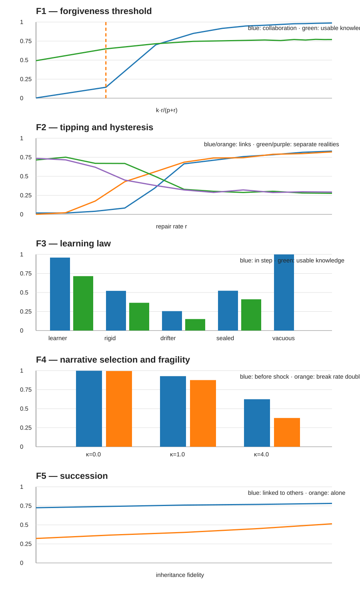

# The SCAP metamodel

**Technical synthesis for the current PR #66 branch.**  The Lean files are the source of truth for proved claims; the F1–F5 simulations are explicitly empirical/model-specific tests of the dynamic extensions.

## 1. Premises

| Premise | Status | Formal role |
|---|---|---|
| **Anchor** — pairwise incompatible views cannot all be correct | logical anchor | `Anchor.lean` |
| **Persistence** — study systems that aim to remain viable / the survivors of a long-run filter | explicit aim/filter | motivates `Persistence.lean` |
| **Change** — future states of the world are not fixed in advance | empirical premise | `OpenAt`, `OpenChange` |
| **Interdependence** — correction/evidence can depend on routes through other models | structural premise | correction graph, `Reach`, network layers |
| **Finite resources** — maintained correction structure consumes a finite ledger | empirical/resource premise | `Bridge.lean`, `Realization.lean`, `NetworkEconomics.lean` |
| **Correctability aim** — whichever live view turns out to be right should remain able to correct the system | chosen aim | `CorrectabilityAim` |

No claim below is meant to hide these extra premises inside the anchor.

## 2. One loop

The metamodel can be read as one recurrent process:

1. **Evidence closes possibilities.** Under `EvidenceDiscipline`, candidate worlds disappear only through evidence.
2. **Challenges open room.** A still-live challenge must be answerable/tracked rather than merely heard.
3. **Faithful links carry content.** Exact `FaithfulChannel` transmission preserves meaning on candidate worlds. The older `Network.Honest` condition is retained as the weaker notion of live-preserving sharpening.
4. **Repair restores routes.** Links may fail; bounded repair turns a permanent split into bounded delay.
5. **Persistence requires maintenance.** The correction structure must fit the resource ledger and remain revisable as conditions change.

Inheritance and narratives are second-order mechanisms that can help reproduce those conditions across generations. Their selection dynamics are tested in F4–F5; they are not assumed to be a Lean consequence of the anchor.

## 3. Eleven claims and their status

**L1 — Anchor.** While incompatible rival views remain live, none is guaranteed across all candidate worlds. **Lean:** `open_room_no_guarantee`, represented-view results in `Semantics.lean`.

**L2 — Learning under change.** A record fixed independently of what happens can remain in step with every possible future only by admitting every still-possible world. A sealed informative constraint fails in some possible future. A learner that follows reliable evidence remains in step. **Lean:** `Persistence.deaf_must_be_vacuous`, `sealed_constraint_fails`, `learner_in_step`, `learning_witness`. **Simulation:** F3.

**L3 — Reach.** Conditional on liveness plus the chosen correctability aim, correction routes must remain available; a missing route leaves an open world in which the omitted model is right and cannot correct the target. **Lean:** `missing_route_leaves_uncorrectable_error`, strong-connectivity results.

**L4 — Shared reality.** `Persistence.reality` is the prior intersected with all evidence whose source can reach the agent. Mutually reachable agents have the same reality; a strongly connected web therefore shares one such evidence-defined reality. Reliable evidence keeps the true world in every reality. Disjoint realities imply that some evidence is false. Connection can expose inconsistent evidence that separation hides. **Lean:** `same_component_same_reality`, `shared_reality_when_connected`, `disjoint_realities_imply_false_evidence`, `hidden_versus_revealed_conflict`. **Simulation:** F2 studies a graded analogue.

**L5 — Semantic fidelity.** Structural connectivity is insufficient when a boundary destroys or replaces member content. `blind_cut_blocks` and `pairs_position_blocks` exhibit this failure. Exact `FaithfulChannel` is the architectural condition used for preservation-of-meaning claims.

**L6 — Aggregation.** The group union record preserves member possibilities. `aggregation_under_anchor` is a narrow theorem about literal intersection of mutually incompatible complete views; it is **not** a theorem against ordinary deliberation, compromise, voting, or action selection.

**L7 — Repair.** If links only break, a missing route remains missing (`no_repair_split_permanent`). If every baseline edge is restored within `R` steps, a baseline route of `m` edges is temporally reachable within `m*(R+1)` (`repair_bounds_delay`); strong connectivity plus bounded repair makes fragmentation a delay rather than permanent loss of reach (`forgiveness_turns_split_into_delay`). The stochastic threshold `k*r/(p+r) > 1` and hysteresis are **simulation + random-graph theory**, not Lean theorems. **Simulation:** F1–F2.

**L8 — Economy and realization.** `Realization.Implements` makes graph edges bounded Layer-1b correction episodes; an `m`-hop route takes at most `m*T` process steps and `m*K` run cost. Resource feasibility is separate: maintained links/items must fit the CRM ledger. One-hop all-pairs distance forces the complete directed graph, whose link demand grows quadratically while the simple per-member resource term grows linearly. **Lean:** `implemented_correctable`, `relay_run`, `latency_one_forces_complete`, `flat_ceiling`, `latency_upkeep_frontier`, `NetworkEconomics`.

**L9 — Selection of repair narratives.** When repair is costly in the F4 model, selection can erode repair toward a fragile regime despite present connectedness. **Simulation only:** F4. This is not currently a universal theorem.

**L10 — Succession.** F5 tests substitution between inheritance across time and links across contemporaries. The proved part is narrower: a sealed inherited rule remains subject to the learning law (`sealed_narrative_fails`). **Simulation + Lean component:** F5 and `Persistence.lean`.

**L11 — Reflexivity.** A self-fulfilling narrative is not thereby verified: compliance-generated observations cannot eliminate a live world in which compliance occurs but the narrative's claim is false. A self-sealing narrative is subject to L2. **Lean:** `self_fulfilment_is_not_verification`, `sealed_narrative_fails`.

## 4. SCAP is now a formal object

`SCAP.lean` packages the theorem-level invariant as an explicit conjunction rather than treating it as an implication of the anchor:

```text
SCAP.Invariant =
  Connected   ∧
  Faithful    ∧
  Evidence-open ∧
  Repairable  ∧
  Affordable
```

More precisely:

- **Connected:** baseline correction graph `E0` is strongly connected.
- **Faithful:** each baseline edge uses exact `FaithfulChannel` transmission.
- **Evidence-open:** each temporal public record follows the evidence supplied to it; reliable evidence therefore keeps it in step with the actual trajectory.
- **Repairable:** every baseline link is present again within bounded delay `R` (`RepairWithin`).
- **Affordable:** the explicitly counted maintained correction structure satisfies the CRM `Ledger.Affordable` predicate.

The stochastic forgiveness threshold is deliberately outside the structure: it is one model-specific sufficient criterion for large-scale connectivity, not the definition of repairability.

### Top-level theorem

`SCAP.scap_persistent_correctability` combines the layers. Given a SCAP invariant and a `Realization.Implements` contract, it proves simultaneously that:

1. the current Layer-1b correction system is structurally correctable;
2. every pair has a counted exactly-faithful baseline relay;
3. bounded repair restores temporal access along that route within `m*(R+1)` steps from any start time;
4. the maintained correction structure is affordable under the stated ledger.

The theorem intentionally does **not** identify temporal waiting/repair with a single globally-clocked `Operational.Process.Run`. Concurrency, capacity and attention are still open refinements.

## 5. Simulation layer F1–F5

The scoped simulation files live under `sim/` and are a graded counterpart of the set-based proofs:

- **F1:** repaired-link percolation; largest collaboration follows the random-graph transition around `k*r/(p+r)=1`.
- **F2:** disagreement-dependent break/repair can produce tipping and hysteresis.
- **F3:** in the frozen result snapshot, learners remain in step about 0.958 of the time; rigid and sealed models about 0.52; drifters about 0.26; a vacuous model is always in step but has zero usable knowledge.
- **F4:** with high repair cost (`κ=4` in this implementation), the largest collaboration falls from about 0.624 to 0.378 after the break-rate shock; with zero repair cost it remains about 0.998 to 0.995.
- **F5:** peer links substantially reduce dependence on inheritance fidelity in this model.

The frozen numbers are in `sim/results/fragmentation.json`; `fragmentation_experiments.py` regenerates them and the F-series figures. E1–E8 CRM simulations remain canonical in PR #65 and are not duplicated here.



## 6. One model across scales

The same `Network.Model` type and the same transition-level tracking law can represent a hypothesis within a learner, one person, a group, a group of groups, or a human–AI network. Scaling adds doors, interfaces, routing, repair and resource conditions; it does not introduce a second epistemic law.

The group union record is an **epistemic envelope**. It does not yet choose a single collective action. A separate action-selection layer remains open.

## 7. Verification

Current Lean checkpoint: **227 audited headline results**, built with Lean 4.33 core only.

For the three Step 6 common-ground results added to the audit:

- `informative_content_has_live_rival` uses no axioms;
- `shareable_iff_rules_out_nothing` uses no axioms;
- `agreement_witness` uses only `propext`;
- **0** audited results use `sorry` / `sorryAx`.

The Lean sources and `Audit.lean` remain authoritative for the full axiom-dependency breakdown.

Verified by GitHub Actions run `36046071150`.

## 8. Open formal frontier

The next work is narrower than before: relate the process-family and addressed-content operational encodings; combine temporal repair/waiting with a globally clocked executable process; replace homogeneous time/cost bounds with heterogeneous and capacity-constrained ones; introduce stochastic failure/repair theorems where possible; and connect topology degradation to the CRM critical-mass/hysteresis dynamics rather than only to affordability. Collective action remains deliberately separate from the epistemic envelope.
