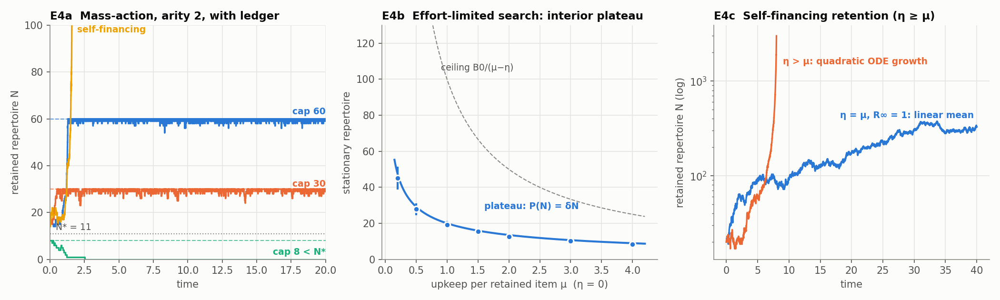
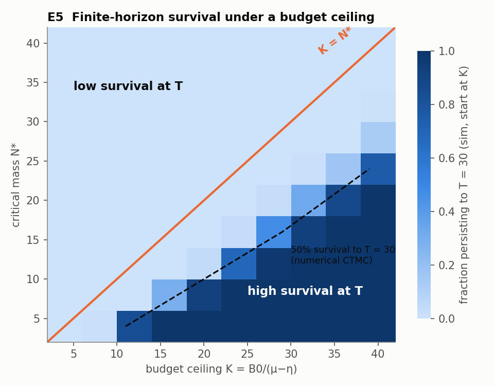

# Cumulative Reproduction Model (CRM)

A reviewed research extension to [EbE v20](../../THEORY_CORE_V20.md): a count-level model of retained organization producing further items while paying upkeep and suffering loss.

Start with [THEORY.md](THEORY.md). [REVIEW.md](REVIEW.md) records corrections to the supplied package; [VALIDATION.md](VALIDATION.md) records independently executed checks. This research package does not supersede the canonical v20 theory or claim established novelty.

The ledger bound survives review: with constant finite external budget B₀ and linear net upkeep μ−η>0, every affordable repertoire has N≤B₀/(μ−η). Growth thresholds and speed formulas require the specified production law. Finite-time survival, eventual survival, finite-target hitting and deterministic growth are different quantities.

| Path | Contents |
|---|---|
| `lean/CumulativeReproduction.lean` | Standalone Lean 4 integer recurrence proofs and 16 named axiom audits |
| `sim/crm.py` | Gillespie simulation, CTMC generator, deterministic closure and analytic formulas |
| `sim/experiments.py` | Experiments E1–E8 |
| `sim/test_crm.py` | Regression and counterexample checks |
| `sim/results/results.json` | Reviewed full-run numerical results and environment metadata |
| `sim/figures/` | Regenerated, relabeled figures |
| `provenance/` | Submitted theory/results and input checksums, retained for comparison |

## Reproduce

Run from this directory. Install [elan](https://github.com/leanprover/elan) for Lean; the checked toolchain is pinned to v4.33.0 and needs no Mathlib.

```bash
(cd lean && lean CumulativeReproduction.lean)
python -m pip install -r requirements.txt
python -m unittest discover -s sim -p 'test_*.py' -v
python sim/experiments.py --output-dir /tmp/crm-full
# Reduced Monte Carlo run counts, separate outputs:
python sim/experiments.py --quick --output-dir /tmp/crm-quick
# Optional selection (same mode and schema as any existing output):
python sim/experiments.py E4 E5 --output-dir /tmp/crm-selected
```

The default output directory is `sim/`; use `--output-dir` to keep committed results unchanged. The CI workflow compiles Lean, rejects `sorryAx`, runs regressions and runs E1–E8 in quick mode. Quick Monte Carlo output is a smoke check, not the full-run evidence table.

## Figures





E5's high-survival region is finite-horizon metastability: under these finite-cap, no-immigration assumptions, eventual extinction still has probability one.
